# B2B Online Retail Pack

> **Information Source:** This portfolio uses the [Online Retail II UCI dataset from Kaggle](https://www.kaggle.com/datasets/mashlyn/online-retail-ii-uci/data). For the purpose of the analysis, this dataset is treated as a B2B online retailer, *(testing was done to confirm)*. We extract end-to-end commercial analytics and provide strategic recommendations for senior-leadership. *(Guest checkouts are excluded from this view. See [ETL pipeline](https://github.com/sachaplaye/rfm-lifecycle-segmentation/blob/main/notebooks/1_data_staging.ipynb) for data preparation steps).*

*Information is as of close of business 30th Nov 2011.*

---
## Business Report
#### The business is experiencing Strong Regional Performance, Mild Customer Growth and a Retention Challenge.

With 4.3k, B2B customers we are currently posting £8.2m net revenue, 1.5% favourable to prior year. UK Domestic makes up 90% of our customers and 83% of total revenue. In our international base APAC customers average 2.5 times more value than UK Domestic and EMEA average 40% more value.

Looking at customer lifecycle the business is highly Acquisition focused. 1.3k customers account for the majority share of revenue with a steep drop off from our Champions down the ladder to Lost Business.

Stability of the base is currently driven by our Key accounts (£5.9k spend per customer) and customers with a wider basket who purchase more stock are up to 50% less likely to churn then those buying less stock or a narrower product range. Whilst Churn rate of Key accounts is low at 3.4% and net revenue retained (NRR) at 95%, the rest of our customers have high churn rate (>19%) and our Core accounts are leaking revenue with 60% net revenue retained year over year. Furthermore our in-life customer view shows a contraction of 3.2% year over year for existing customer spend.

**In summary:** Acquisition is driving most of the business forward with UK Domestic making up our core Market. With an overall NRR of 84% for our existing customers, any drop in sales will expose the business.

#### Recommendations:
- **Retention:** We have 225 Top-tier account traders that are actively engaged with us, generate £665k revenue but are declining by more than -4.5% revenue per month. These customers should be contacted for a health check call by our account managers pre-armed with any information on customer dissatisfaction, internal slow down or switching of stock lines to competitors.
- **Lapsed & Winback:** 114 Key accounts make up £184k. They are declining by more than -3% in revenue and have missed 1 to 2 quarterly restock cycles. These can receive a personal call from account managers. 156 Core accounts make up £89k and can be targeted with an email offer tied to their purchase behaviour. (Core accounts average £567 spend per customer, which is more suited for an email marketing campaign).
- **Upsell Opportunity:** 171 Top-tier account customers who generate £960k are actively trading and growing at more than 4.5% per month. However, these customers show purchase behaviours of either wide basket but low volume or they are buying narrow product range. There is opportunity to upsell these customers to widen their basket and increase quantity of purchase, as this will likely improve churn rate for this cohort and grow revenue. (Historical evidence shows the lowest churn rate for this purchase behaviour).
- **Re-activation:** Of 1.5k Churned customers year over year, 53 are Key accounts with prior year spend of £279k. They averaged £5.3k spend per customer and can recieve a relationship recovery call by account managers, with personal email follow-up for un-aswered calls. 332 Core accounts with yearly spend of £401k, (£1.2k per customer) can receive an email and trigger a notification to account managers if they have shown intent. The rest of the 1,145 Standard accounts with prior year spend of £318k, (averaging £277 per customer) can be pushed through automated email marketing and self serve.
- **Expand International:** Average spend of an APAC customer is 2.5 times higher than a UK Domestic customer. EMEA is 40% higher. There is opportunity to allocate targeted acquisition budget toward B2B outbound sales in APAC and EMEA.

*See the "Churn Prevention & Growth" Section at the bottom of this report for the backing behind the recommendations*

---
## Contents
- [1. Business Report](#business-report)
- [2. Business Performance](#business-performance)
- [3. Customer Lifecycle & Value](#customer-lifecycle--value)
- [4. Buying Behaviour](#buying-behaviour)
- [5. Churn Prevention & Growth Recommendations](#churn-prevention--growth-recommendations)
- [6. Data Integrity](#data-integrity)
---
---
## Business Performance
[back to contents](#contents)
<!-- 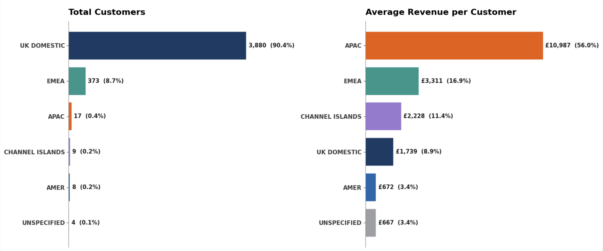 -->
#### B2B Customer Base by Region in the last 12 months:

- **UK Domestic** provides a high-volume foundation for the business, accounting for 90% of the customer base and 83% of total revenue.
- **International View:** While customer volume is lower, both APAC and EMEA deliver significantly higher average revenue per customer. If we strip out whale accounts (>£30k annual spend), APAC averages £3.9k per customer (2.5 times the UK average of £1.4k). EMEA, which accounts for 9% of the customer base by volume and 15% of total revenue, provides 40% more revenue per customer (at £2.0k).

**Expand the Base:** With the UK Domestic market generating most of the net revenue but APAC and EMEA providing more revenue on a per customer basis, there is opportunity to allocate targeted acquisition budget toward B2B outbound sales in APAC and EMEA. This would allow us to expand our presence in those markets whilst mitigating the risk of over exposure to any negative macro economic headwinds in the UK market place.

---
#### Customer Net Gain View - Year over Year (YoY):
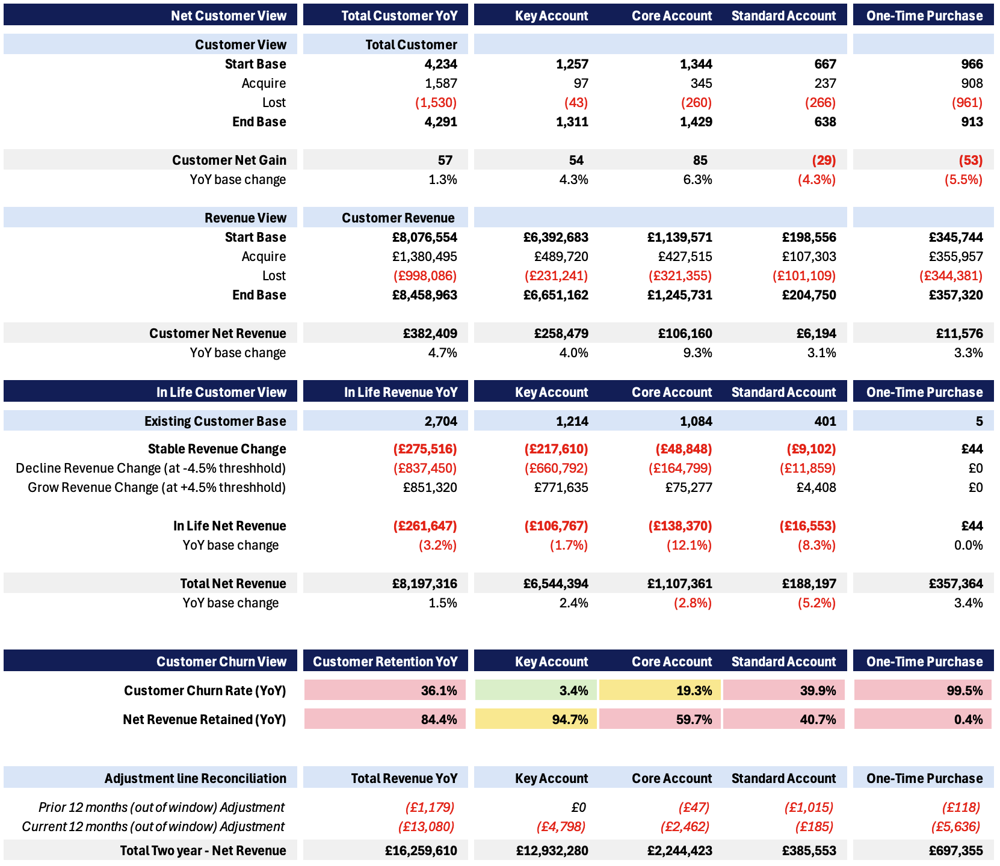

- **Net Customer View** shows a growth of 1.3% in customer volume year over year, driven by strong acquisition figures for Key accounts and Core accounts. This is accompanied by a 4.7% growth in Net Revenue to £8.2m, with 2/3rds of the incremental revenue driven by Key accounts. 
- **Existing Customer View:** Growing customers (set at 4.5% monthly threshold) are outperforming Declining customers. However, the health of the Stable base is deteriorating. We are seeing a net contraction of (3.2%) in-life revenue year over year. A significant proportion of this is caused by an erosion in value of Core accounts and Standard accounts, which brings Net Retained Revenue down to 84% YoY for existing customers
- **Customer Churn Rate** at 36.1% year over year is high. Key accounts are doing well at only 3.4% Churn. Yet, we are struggling to retain Core accounts and Standard accounts that make up a significant portion of the base. This is coupled with high shrinkage in net retained revenue of 60% for Core accounts and 41% for Standard accounts.
- **One-Time Purchases:** These one-off transactions make up 23% of the customer base by volume. Net Growth in this segment is flat YoY, in that we are not really making more of these potential customers stick versus prior year.

**We are performing strongly** in terms of Acquisition and Retention of our Key customers, with a churn rate of 3.4% and 95% revenue retention with £6.5m yearly net revenue making up 80% of total revenue.

**We need to target** 823 accounts in decline which contribute (£837k) reduction in yearly revenue. The majority of customers in the declining segment are 435 Core accounts and 297 Key accounts, which are leaking (£661k) of revenue.

---
---
## Customer Lifecycle & Value
[back to contents](#contents)
#### B2B Customer Lifecycle in the last 12 months:
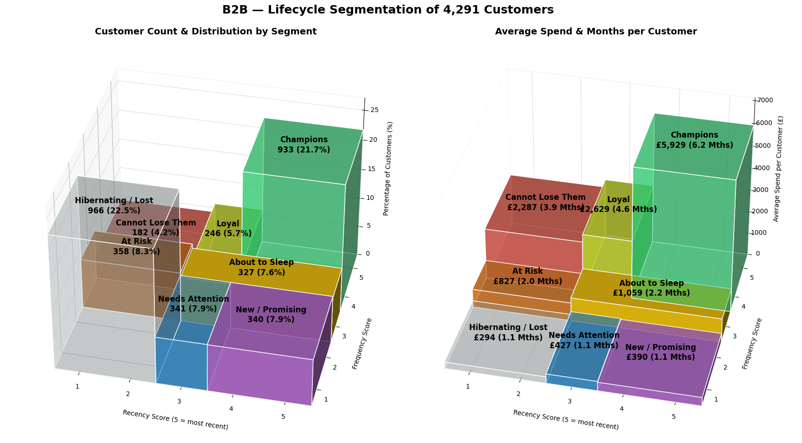

50% of these customers are non-seasonal year round purchasers and 62% traded with us two years running, of which 20% are year on year seasonal repeat purchasers:

- **We have a U-shaped distribution** between Lost and Champions both making up 22% of the base. £5.5m, (68%) of total revenue spend is provided by 933 accounts. If we include Loyal and 'Cannot lose them' customers, we see the business is serving 1.4k customers well and the other 3k customers contribute relatively little revenue.
- **There is a big drop from Champion to Loyal**. We need to understand what the breakdown of the £2.6k spend customers are and if there is potential for upsell. We seem to be focused on customer acquistion here. We look at this in more detail in the buying behaviour summary.
- **23% are hibernating / Lost:** With 1.1 mth average frequency these 966 customers are made up in majority of the 913 One-Time Purchasers. With an average revenue of £294 per customer contributing £284k overall revenue this may not be worth the marketing spend for reactivation campaigns. 

---
#### Size of Account Revenue Generation versus Lifecycle:
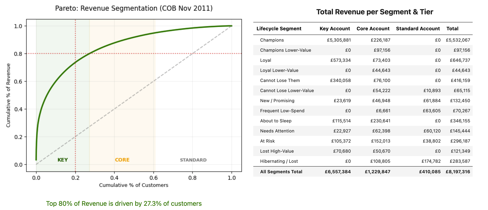

- **If we split Lifecycle by Pareto distribution** and look at total net revenue, we see significant revenue footprint in the lower Frequency and Recency segments for Key and Core accounts.
- **Between the 'About to Sleep' and 'At Risk'** segments, there is £663k revenue for 655 customers who that did not trade recently.
- **Combining this with £416k revenue** from 182 accounts in the 'can not lose' segment and we have a total of over £1.1m in high-tier revenue we need to look into.

---
---
## Buying Behaviour
[back to contents](#contents)
<!-- 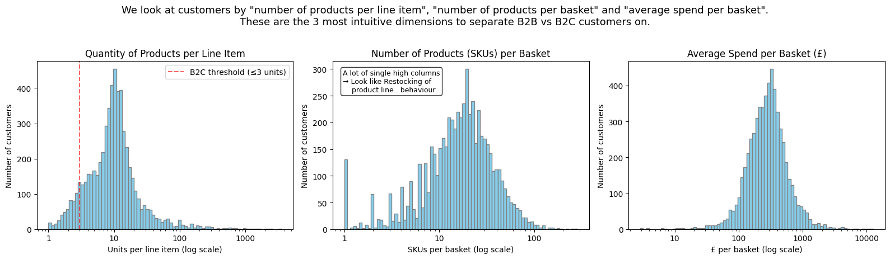 -->
#### Historical size of Customer Basket & Revenue. Yellow is more, blue is less:

  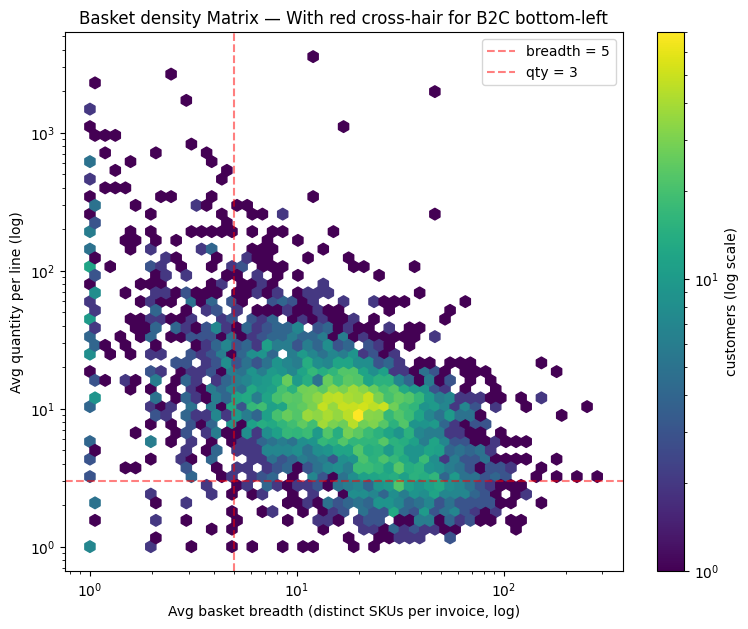
  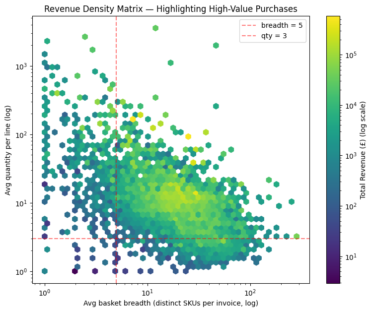

#### On a per basket basis:
- We have a concentration of customers on the left in the form of vertical columns who buy narrow.
- We have one main cluster of customers centred around 10 units of stock depth per item and 20 units of stock breadth per basket.
- The cluster also has a gradient from top-left, high-volume of narrow stock lines to bottom-right, lower-volume of wide stock lines with barely any high-volume wide-basket customers in the top right quadrant.

---
#### We Quantify this by Basket Breadth & Depth:

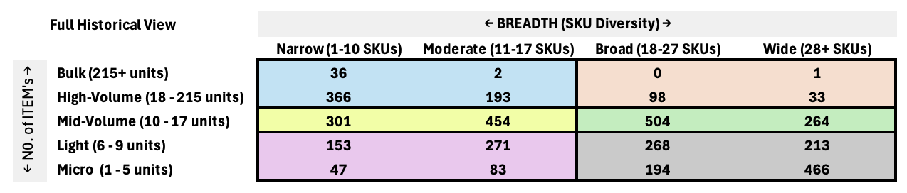
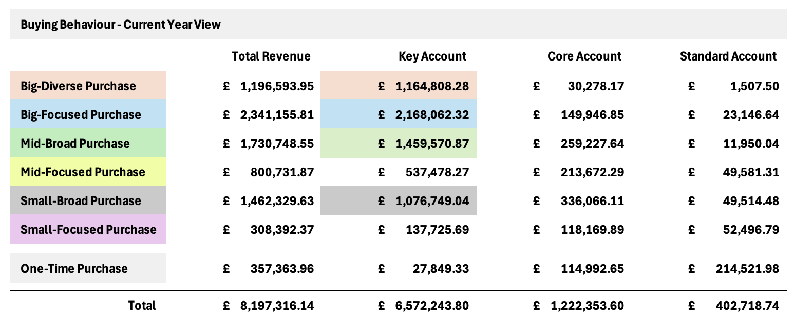

*We use percentiles to split the basket evenly into groups based on the distribution. We would use K-means clustering (separate portfolio exercise) and compare back to Firmographics to derive customer profiles but the above works fine for our understanding.*
- Four behaviours of Big-Diverse, Big-Focused, Mid-Broad and Small-Broad basket spend account for 1.1k of the total 4.3k customers in the last 12 months.
- Their combined spend make up £5.87M, which is around 89% of total Key Account revenue and 72% of total revenue.
- The Mid-Focused group with 643 customers make up the second largest cohort accounting for 15% of the base but only generate £800k, which is 10% of the total revenue

---
#### Customer Churn by purchase behaviour

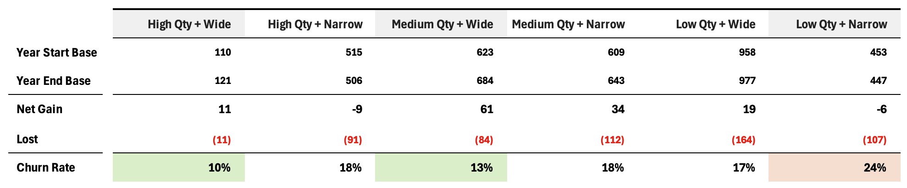

Looking at Churn profile by purchase behaviour, we see that customers who buy a Narrow range of product lines or a low volume of stock are more likely to Churn than those who buy a wider range and more volume in their basket.
- Customers who purchase (Medium & Wide), 10-17 units and a range of 28 or more product lines are 1 / 4 times less likely to churn.
- Customers who purchase (High & Wide), high volume and a range of 28 or more product lines are nearly 1 / 2 times less likely to churn.

---
---
## Churn Prevention & Growth Recommendations
[back to contents](#contents)
#### Immediate action on 225 High-tier active traders declining -4.5% or more for Customer Retention.
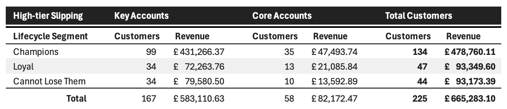

We have 225 Top-tier accounts that are actively trading and engaged with us but are reducing their spend by 4.5% or more per month. These customers account for £665k of current year revenue.
- We are leaking revenue and possibly losing trade to competitors on active high-value traders, so intervention on this cohort should be prioritised over the other campaigns.
- We should do a deep dive into these customers purchase history, any information on returns and delay of delivery that lead to customer dissatisfaction, indicators of internal slow down or switching of stock lines to other competitors.
- These accounts should then be contacted directly by our account managers for health check with the additional pre-call intelligence.

---
#### 270 Customers in Decline for Lapsed & Winback Campaigns
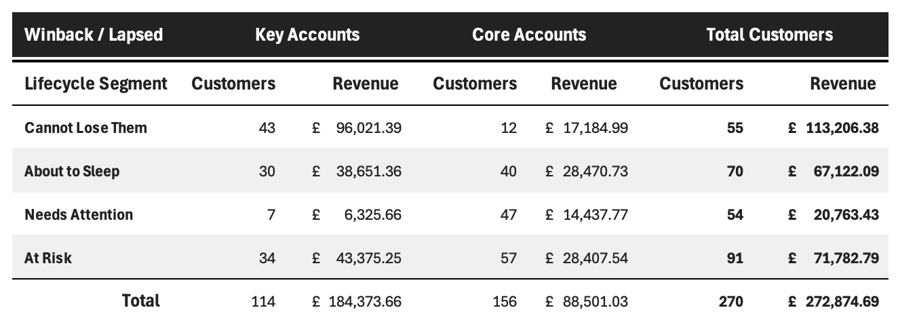

These warrant proactive outreach with an offer. All 270 customers with less than -3% decline in monthly revenue qualify for Lapsed (1 quarterly restock cycle) and Winback (>=2 cycles) promotional campaigns tailored to their basket behaviour.

- 114 Key accounts making up £184k, (£1.6k average spend per customer) get a personal call from account managers. 
- 156 Core accounts making up £89k, (£0.6k average spend per customer) get a targeted email with offer linked to their purchase behaviour.

---
#### 171 Growing Customers with Upsell Opportunity
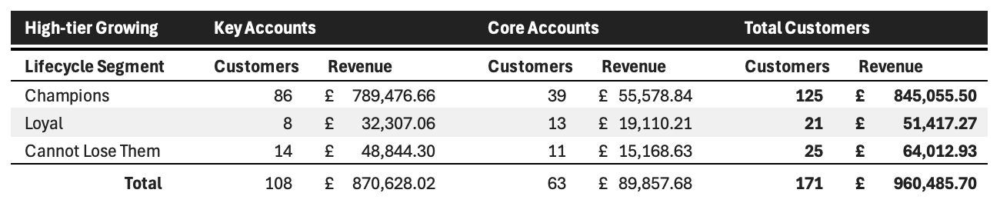

We have 171 High-Tier customers generating £960k net revenue, who are growing more than 4.5% per month. These are filtered on buying behaviour of medium / high for narrow baskets or low quantity for wide baskets. 
- However, based on the Churn Profile by purchase behaviour results section above. They are in the higher Churn bracket of around 17-18%.
- We should look into how we can upsell these customers to widen their basket and increase quantity of purchase as this will likely improve churn rate for this cohort and grow revenue.

---
#### 385 Churned customers year over year for Reactivation Campaign

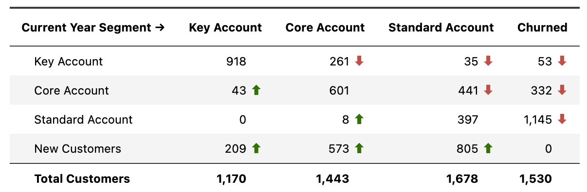

The above view shows the change in Value Tier year over year to identify larger historical customers who now trade less.
- Of 1.5k Churned customers 53 are key accounts with prior year spend of £279k and average spend of £5.3k per customer. These can receive a relationship recovery call by an account manager and unanswered calls can receive a follow-up manual email or direct mail.
- We can put 332 Core Accounts with prior year spend of £401k averaging £1.2k per customer into a targeted email journey. If they click on links or visited our website several times and have shown intent it could trigger a notification for an account manager to call them. We can include a scheduling link in the email if they want to book a catch-up call.
- 1,145 Churned customers with prior year spend of £318k averaging £277 per customer. We can push these through fully automated email marketing and self serve.

---
---
#### Data Integrity
[back to contents](#contents)
- Any purchases made after 30th Nov 2011 are removed from this view to get a two year window. We note there may be some data missing from before 07:00 on 1st Dec 2009 due to data set cut off but analysis shows it will be minimal.
- This is a product only view which excludes re-keys, postage fees, additional charges, warhouse stock changes, dummy accounts used for accounting purposes and such like.
- We removed guest accounts that make up several million in revenue (over two years) from this analysis as they have no account number to distinguish which invoices belong together.

---